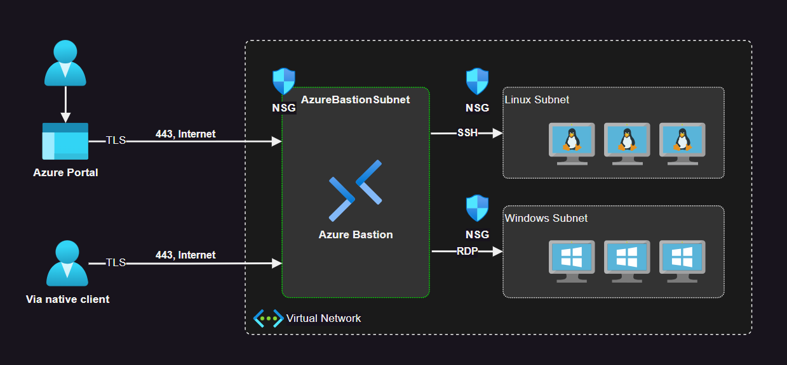

# Azure Bastion Hosts

Bastion configuration with Windows and Linux VMs. Adapted from the official [docs][1]:



Create the `.auto.tfvars` file and set up your variables:

```terraform
# Location
location = "eastus"

# Bastion
bastion_sku = "Basic"

# VMs
provision_linux_vm = true
provision_win_vm   = true
```

Before applying, create a temporary key pair for SSH to the Linux machine:

```sh
ssh-keygen -f ./modules/vms/linux/id_rsa
```

Create the resources:

```sh
terraform init
terraform apply -auto-approve
```

Connectivity will be available with SSH and RDP for the Linux and Windows machines respectively.

To try out native SDK features, upgrade Bastion to the `Standard` SKU:

```terraform
bastion_sku = "Standard"
```

---

Destroy the resources after using it:

```sh
terraform destroy -auto-approve
```


[1]: https://learn.microsoft.com/en-us/azure/bastion/bastion-overview
